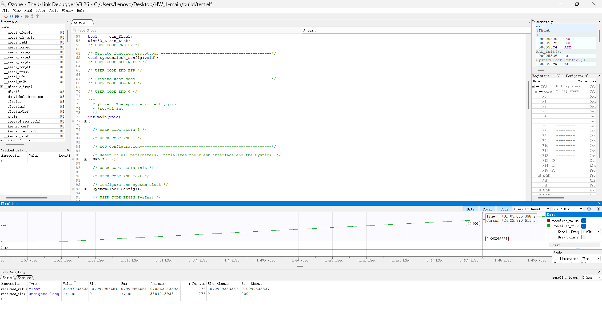

Hello World第一次培训作业
---

### **本周主要工作**

本周我完成了电控组的第一次培训作业，主要涵盖了STM32的三个核心外设应用：

* **LED闪烁与串口通信协议实现**
    * **LED闪烁**：配置了系统时钟和TIM定时器，通过中断服务程序实现了1ms的精准定时。在此基础上，通过计数控制LED以1Hz的频率稳定闪烁。这部分内容之前已经比较熟悉，所以完成得比较顺利。
    * **串口通信**：
        * 定义了一个全局变量`tick`，在定时器中断中自增，作为系统运行时间的标记。
        * 根据作业要求，设计了包含帧头、`tick`值和`value`值的9字节通信协议。其中`value`的值根据公式 $value=sin(\frac{tick}{1000})$ 动态计算 [cite: 16]。
        * 编写了`encode`和`decode`函数用于数据的打包和解包 。

* **串口DMA与状态机接收**
    * **DMA发送与接收**：为了提高数据传输效率，将串口发送和接收改为DMA方式。重点调试了DMA中断接收的配置 。
    * **状态机接收**：在接收端，设计并实现了一个基于状态机的接收逻辑，用于稳定、可靠地解析数据帧，并成功在Ozone中观察并验证了收发数据的一致性。
    * **CMake与Debug配置**：在调试过程中，发现必须在CMake中将项目配置为Debug模式生成仿真文件，才能正常连接Ozone进行硬件在环调试。

* **CAN通信协议学习与实现**
    * **CAN通信协议设计**：这是本次学习的重点。我自定义了一个8字节的CAN通信协议，用于打包一个结构体，其中包括`tick`、`value1`、`value2`以及四个布尔标志位。
    * **Loopback模式调试**：由于硬件限制，在CubeMX中将CAN外设配置为自收自发的Loopback模式进行功能验证。
    * **ID过滤器配置**：根据要求，配置了CAN的ID过滤器，使其只接收ID为`0x100`的报文。

### **遇到问题**

1.  **BUG1：数据类型溢出导致逻辑错误。**
    * **问题描述**：在实现某个计数逻辑时，最初使用`uint8_t`类型的变量进行计数。由于`uint8_t`最大只能存储到255，当计数值需要超过255（例如，计数到1000ms）时，变量会溢出重置，导致依赖此计数的判断条件永远无法满足。
    * **解决方案**：将相关计数变量的数据类型从`uint8_t`更改为`uint16_t`或`uint32_t`，确保其有足够的范围来存储目标计数值。

2.  **BUG2：DMA数据宽度配置不一致导致数据错乱。**
    * **问题描述**：在配置DMA进行串口数据接收时，外设（UART_DR）的数据宽度为字节（8位），而内存目标地址（数组）的数据宽度也被错误地设置成了半字或字。这导致DMA控制器每次传输的数据宽度不匹配，最终写入内存的数据包含了非预期的额外内容，导致解包失败。
    * **解决方案**：仔细检查了DMA的配置，确保外设（Peripheral）和内存（Memory）的数据宽度（Data Width）均设置为字节（Byte），保证了数据传输的一致性。

3.  **问题3：Ozone无法正常调试。**
    * **问题描述**：项目编译烧录后，无法使用Ozone连接调试器进行代码调试和变量观察。
    * **解决方案**：经过排查发现是CMake编译配置的问题。需要在CMakeLists.txt中将编译选项设置为`Debug`模式，这样生成正确的目标文件（`.elf`）才会包含用于源码级调试的必要信息。修改配置并重新编译后，Ozone恢复正常使用。

### **其他感想**

这次培训作业非常有收获，它不仅让我复习了定时器和串口通信的知识，更重要的是引导我深入学习并实践了CAN通信。CAN作为一种高效的、抗干扰能力强的总线协议，在机器人和自动化领域应用非常广泛，这次的练习为我后续学习更复杂的系统打下了坚实的基础。

在调试DMA和CAN的过程中，也让我深刻体会到“魔鬼在细节中”。像数据宽度、编译配置这样的小问题，一旦忽略就会耗费大量时间去排查。这提醒我未来在开发时必须更加细心和严谨，对每一个配置项都要有清晰的理解。希望接下来的培训能接触到更多与实际应用结合更紧密的内容。